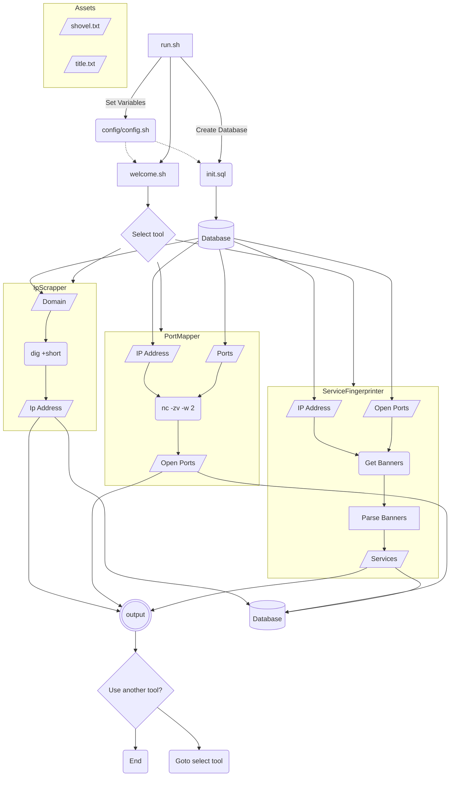

# CS50 Final Project
Intuitive and ergonomic network snooping.

### Checklist

 - [x] **IP Scraper**
        *Return IP address given domain*
	- [x] Use `dig` to get IP address
	- [ ] Run network IP sweep
 - [ ] **Port mapper**
		 *Return open ports of a given ip*
	- [x] Use `nc` to scan ports
	- [x] Remove clutter ( closed ports and useless information)
	- [ ] Display important information concisely and aesthetically
	- [ ] Suggest further actions based on results (redirect to *service fingerprinting* tool?)
	- [ ] Color code output
 - [ ] **Service fingerprinting**
		 *Fingerprint a given port at a given address*
		 
	- [ ] **Netcat Method**
        *Use netcat to detect services*
        - [ ] Run netcat command `nmap -sV <target_ip>` to detect services automatically
	 
	- [ ] **Manual method**
	 *Manually try certain methods of fingerprinting*
	
        - [ ] Get open ports (use `Port Mapper` tool)
        - [ ] Get banners with ncat `nc`
        - [ ] Parse banners for important data
	- [ ] Display important information concisely and aesthetically
	- [ ] Color code output

## Flow Chart

